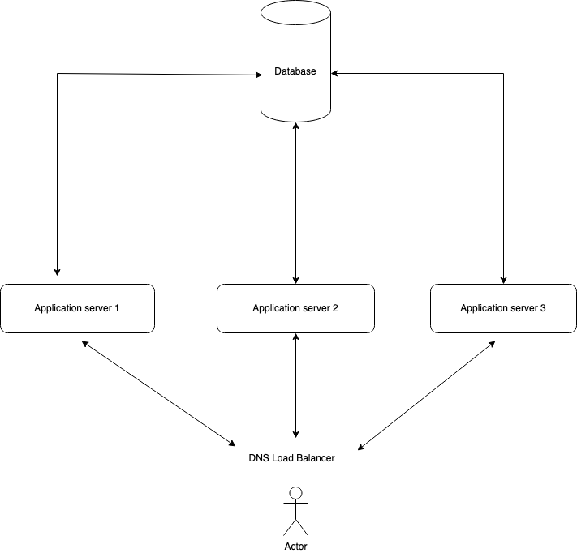

# ABOUT

This is my implementation of the tasks required in the second part of 
the **MORO TECHNOLOGY HELLAS P.C.** process, where I needed to create
some API's to perform specific tasks. 

The APIs were created using the FastAPI framework, while the database of choice
was the SQLite database.

### First API

The first API retrieves information from a 3rd party API at https://gutendex.com/.
Thus, I created a GET endpoint which requests the query information to the Gutendex
API, transforms the output to the required format and returns a json object with the
relevant information.

Here is a brief explanation of the APIs created in this work:

### Second API

The second API (a POST endpoint) creates instances in a database, storing the following information
about books and reviews from a user:
* BookID: The ID of the book to be reviewed;
* Rating: The rating of the book according to the user ;
* Review: A text describing the review of the book from the user.

### Third API

The third API, another GET endpoint, basically joins the contents of the
the two previous APIs: first, from the user input, the API get the book information
from the Gutendex API and join it with the information from the book in the database
I constructed on the second API. The rating presented is basically the mean of the
ratings of the book in the database while the API returns all the reviews present
in the database. 

# Installation:

Before executing the following commands, I strongly recommend that
the isolation of the environment (for example, using the venv library
through the command ```python -m venv venv``` and
 ```source venv/bin/activate``` in a Unix background)
To run the code locally, please perform the following steps:

* ```pip install -r requirements.txt```
* cd into the ```src``` directory
* ```uvicorn main:app --reload --host 0.0.0.0``` (to run locally)

To create mock data to test the APIs, with the server up, run the 
command ```python create_mock_data```. This will populate the database
with random instances.

## Note about PAGINATION

I implemented the pagination system similar to the one in Gutendex,
with the difference that instead of displaying the next url, I display
the next result. For the purpose of this challenge (and the first task)
, I left the pagination handling not allowed. However, if one wants to 
display the pagination, just turn the global variable ```HANDLE_PAGINATION```
to ```True```at the beginning of the ```main.py``` file in the source directory.

Furthermore, while handling the pagination, I limited the number of pages to 6.
One can also change this configuration by changing the variable ```MAX_NUM_OF_PAGES```
in the ```handle_pagination```function in the ```main.py``` file.

## Running tests

To run the tests one should be inside the src folder 
and run the following commands:

To run all tests:
```python3 -m pytest --no-header -v```

To run a single test:
```python3 -m pytest --no-header -v -k <test_name>```


## API Swagger:

To check the API swagger, run the following into a web browser:
    ```localhost:8000/docs```

## API Calling (Locally):

* For the 1st task, the API can be called, locally, through the following curl command:

    ```
    curl -X 'GET' \
    'http://localhost:8000/get_book?request=frankenstein' \
    -H 'accept: application/json'
    ```


* For the 2nd task, one can write a review to the database (again, locally) through

    ```
    curl -X 'POST' \
    'http://localhost:8000/post_review' \
    -H 'accept: application/json' \
    -H 'Content-Type: application/json' \
    -d '{
    "book_id": 84,
    "rating": 4.7,
    "review": "Very good book!"
    }'
    ```

* For the 3rd task, one can call the API (locally) through

    ```
    curl -X 'GET' \
    'http://localhost:8000/get_reviews?book_id=84' \
    -H 'accept: application/json'
    ```


## Extra tasks

Furthermore, I implemented two extra tasks. The first one was
designed to query for the N best books according to the reviews.
The API is a GET endpoint, where the user passes the value of N 
and, according to the average rating, the N best books are returned.
One can call the API (locally) through

    ```
    curl -X 'GET' \
    'http://localhost:8000/get_n_best_books?n_books=10' \
    -H 'accept: application/json'
    ```

The second extra task was to generate a GET endpoint which, given a book ID,
returns its average rating per month. One can call the API (locally) through

    ```
    curl -X 'GET' \
    'http://localhost:8000/get_book_rating_per_month?book_id=84' \
    -H 'accept: application/json'
    ```

## High-level system diagram to deploy such a service in a scalable way
    
To deploy such a service in a scalable way, the following architecture can be used:

